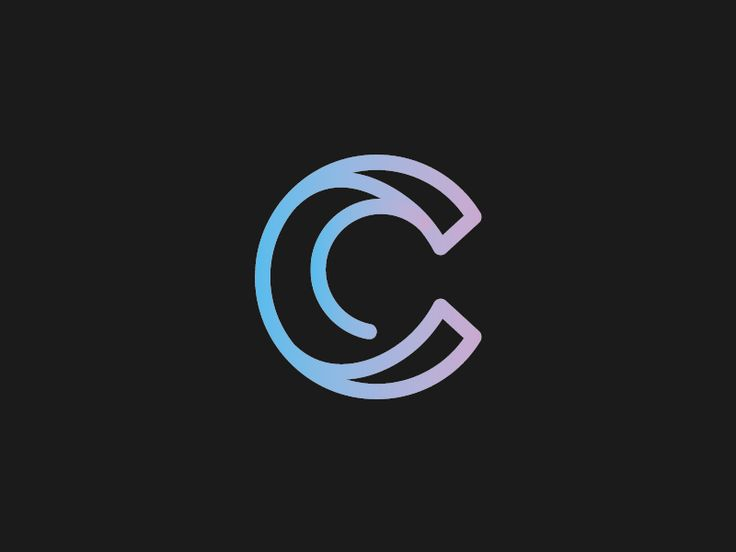

<a name="readme-top"/>

<br/>

<br />
<div align="center">
  <a href="https://github.com/Ceji-B/">
  <!-- TODO: If you want to add logo or banner you can add it here -->
    
  </a>

  <h3 align="center">Final Project</h3>
</div>

<div align="center">
This is our Final Project wherein we were tasked to make a personal website like our past activity. This website will have a resume-like about me, a contact page, gallery, overview of the website and lastly a project showcase. The project showcase would be showing our projects from the start of the Semester up until the last activity.
</div>

<br />


---

<br />
<br />


<details>
  <summary>Table of Contents</summary>
  <ol>
    <li>
      <a href="#overview">Overview</a>
      <ol>
        <li>
          <a href="#key-components">Key Components</a>
        </li>
        <li>
          <a href="#technology">Technology</a>
        </li>
      </ol>
    </li>
    <li>
      <a href="#rules-and-principles">Rules and Principles</a>
    </li>
    <li>
      <a href="#resources">Resources</a>
    </li>
  </ol>
</details>

---

## Overview

For our final project, we were tasked with creating a personal website that showcases our skills, experiences, and projects developed throughout the semester. The website will include the following sections:

1. About Me: A resume-like section providing a detailed overview of my background, education, and professional experience.
2. Contact Page: A dedicated page for visitors to reach out to me via a contact form or through provided contact details.
3. Gallery: A visual collection of images and media that represent my work and interests.
4. Website Overview: An introduction to the website, explaining its purpose and guiding visitors on what they can expect to find.
5. Project Showcase: A comprehensive display of all the projects I've worked on from the beginning of the semester to the final activity, demonstrating my growth and learning journey.

The Project Showcase section is particularly significant as it highlights my progress and the various skills I've acquired. Through this personal website, I aim to provide a professional and polished presentation of my work, making it easy for potential employers, collaborators, and visitors to understand my capabilities and achievements. This project not only reflects my technical skills but also my dedication to continuous learning and improvement.


### Key Components

- MultiPage Website
- Bootstrap
- One page multiple function
- Overview of the Website
- Project Showcase

### Technology
<!-- TODO: List of Technology Used -->


## Rules and Principles
1. Always use ***WD-*** in the Title of the Project for the Subject
2. Do not rename any .html files; always use 'index.html' as the filename.
3. File Structure to follow

```
WD-ProjectName
└─ assets
|   └─ css
|   |   └─ style.css
|   └─ js
|   |   └─ script.js
|   └─ img
|       └─ fileWith.jpeg/.jpg/.webp/.png
└─ pages
|  └─ pageName
|     └─ index.html
|     └─ assets
|        └─ css
|        |  └─ style.css
|        └─ js
|        |  └─ script.js
|        └─ img
|           └─ fileWith.jpeg/.jpg/.webp/.png
└─ index.html
└─ readme.md
```

## Resources

<!-- TODO: Add References -->
| Title | Purpose | Link |
|-|-|-|
| Contact us form-frontend | For the contact function. | (https://codepen.io/JonLehman/pen/yOdbOG) |
| front codes | Used as inspiration and design | (https://front.codes/) |
| Resume Concept | Used as the design for the learn more about me. | (https://codepen.io/bphillips201/pen/AxLKby) |
| Cinematic Animation | Used as the animation and design for the overview. | (https://codepen.io/team/keyframers/pen/LYRmXBX) |

